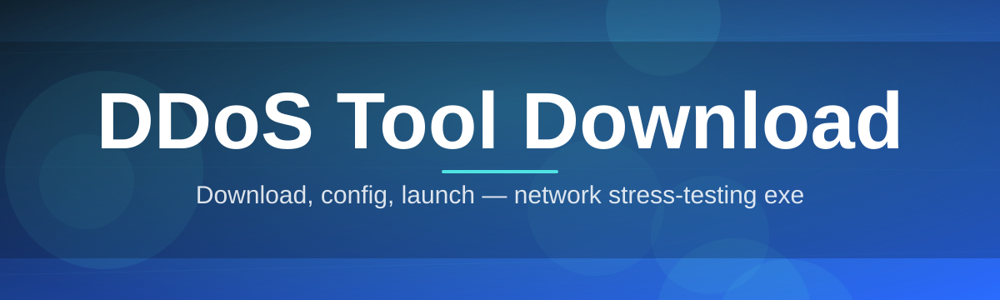

# DDoS-Tool-Download-4727 🛰️⚡

  

*A precision-built network load and resilience simulator, packaged for a single-click Windows download.*

  

## 📡 Overview

DDoS-Tool-Download-4727 is a standalone Windows utility built for one purpose: letting network operators, students, and lab administrators generate controlled, high-volume traffic against systems they own or are explicitly authorized to test. The project exists because most "stress testing" utilities in this space are either bloated enterprise suites locked behind sales calls, or sketchy scripts with no documentation and zero transparency about what they actually send over the wire. This repository fills that gap with a lightweight, auditable, single-executable approach to DDoS tool download workflows — no build chain, no dependency hell, just a binary that does what the label says.

The tool is aimed at people who need to answer a very specific question: *"What happens to my infrastructure under sustained load?"* That includes homelab tinkerers benchmarking their own routers, security students in sanctioned CTF/lab environments, and small ops teams validating firewall and rate-limit configurations before a product launch. It is not a mystery box — every module, every flag, and every packet pattern is documented below so you know exactly what you're running before you run it.

Since its first public cut, this project has grown around a simple philosophy: transparency over obfuscation. There's no telemetry phoning home, no hidden payloads, and no "premium unlock" nonsense. What you download is what executes. That philosophy is why this landing page — not a scattered pile of mirror links — is the only place we point people to for the DDoS tool download itself.

> [!IMPORTANT]
> This tool is intended strictly for testing infrastructure you own or have written authorization to test. Directing traffic at third-party systems without consent is illegal in most jurisdictions. See the Disclaimer section before running anything.

---

## 🎯 What It Actually Does

**Multi-vector traffic generation** — sends configurable HTTP flood, UDP flood, and SYN-style traffic patterns from a single unified engine, so you can simulate multiple attack shapes without juggling separate tools.

**Adaptive thread scaling** — automatically scales worker threads based on your CPU core count and the target's observed response latency, avoiding the "one setting fits nobody" problem.

**Live throughput dashboard** — an in-app console panel renders packets-per-second, bandwidth consumption, and error/timeout ratios in real time, updated roughly every 250ms.

**Target profile presets** — save named configurations (host, port, protocol, duration, thread count) so repeat testing against the same lab target takes one click instead of five.

**Session logging & export** — every run writes a timestamped `.log` and optional `.csv` summary to a local `logs/` folder for later analysis or reporting.

**Graceful throttle mode** — a built-in rate-limiter lets you cap output bandwidth, useful when you want to test degradation curves instead of instant saturation.

**Zero-dependency binary** — the entire tool download is one `.exe`; no runtime installs, no framework prerequisites, no background services.

**Dark and light interface themes** — because staring at a terminal for hours during an overnight resilience test shouldn't hurt your eyes.

---

## 🧭 How To Get Started

1. **Visit the landing page** via the download button above — this is the only source we maintain.

2. **Download the executable** — a single `.exe` file, no installer wizard, no bundled add-ons.

3. **Run it directly** — double-click, or launch from a terminal for verbose logging output.

4. **Configure your target profile** — enter host, port, protocol, and duration, then start the session from the dashboard.

> [!TIP]
> First-time users should run a short 10-second session against a local test server before attempting longer durations. It's the fastest way to sanity-check your network path and firewall rules.

---

## 🖥️ System Requirements

| Requirement | Minimum | Recommended |
|---|---|---|
| OS | Windows 10 (64-bit) | Windows 11 (64-bit) |
| RAM | 2 GB | 8 GB |
| CPU | Dual-core | Quad-core or better |
| Disk | 50 MB free | 200 MB free (for logs) |
| Network | Any active adapter | Wired connection for consistent throughput |
| Dependencies | None | None |

  

> [!NOTE]
> The tool is fully self-contained. There is no separate runtime, no .NET redistributable, and no background installer service left behind after use.

---

## ⚙️ How It Works

The engine follows a straightforward pipeline from configuration to output, designed so you always know what stage a session is in.

1. **Configure** — set target, protocol, thread count, and duration in the dashboard.

2. **Validate** — the tool performs a lightweight reachability check before committing resources.

3. **Dispatch** — worker threads spin up according to your scaling settings and begin sending traffic.

4. **Monitor** — the live panel streams packets-per-second, latency, and error rate for the duration of the run.

5. **Report** — on completion, a summary log and optional CSV export are written locally.

---

## 🧩 Troubleshooting

<strong>The dashboard shows zero throughput even though the session is "running"</strong>

Check that your target host/port combination is actually reachable — most zero-throughput cases trace back to a closed port or a firewall silently dropping outbound packets. Run the validation step manually before starting a full session.

<strong>Windows Defender or my antivirus flagged the executable</strong>

Traffic-generation tools frequently trigger heuristic flags because of their networking behavior pattern, not because of any embedded payload. Verify the file hash against the one listed on the landing page before allowlisting it in your security software.

<strong>Thread count field is greyed out</strong>

Adaptive scaling mode locks manual thread input by design. Switch to "Manual" mode in Settings if you want direct control over worker count.

<strong>My CSV export folder is empty after a session</strong>

CSV export is opt-in and must be enabled in Settings > Logging before the session starts; it is not retroactive for sessions already completed.

<strong>The tool exits immediately after launch</strong>

This usually means a corrupted or partial download. Re-download from the landing page rather than a cached copy, and confirm your antivirus isn't quarantining the file silently.

---

## 🎨 UI / UX Details

> [!TIP]
> Everything below is configurable from the **Settings** gear icon in the top-right of the dashboard.

- **Themes**: Dark (default), Light, and High-Contrast for accessibility.

- **Keyboard shortcuts**:

  | Shortcut | Action |
  |---|---|
  | `Ctrl+R` | Start session |
  | `Ctrl+S` | Stop session |
  | `Ctrl+L` | Open log folder |
  | `Ctrl+E` | Export current session as CSV |
  | `Ctrl+,` | Open Settings |
  | `F1` | Open in-app documentation panel |

- **Layout**: resizable split-pane between config panel and live throughput graph.

- **Notifications**: optional toast alert when a session completes or errors out.

---

## 🤝 Contributing & Community

> [!NOTE]
> Issues and pull requests are welcome. This project grows by community-reported edge cases, not by guesswork.

- Open an issue for bugs, feature requests, or documentation gaps.

- Discussion threads are the right place for configuration questions before filing a formal issue.

- Please describe your test environment (OS build, network setup) when reporting throughput anomalies — it dramatically speeds up triage.

---

## 📜 License

Released under the [MIT License](LICENSE), 2026.

---

## ⚠️ Disclaimer

> [!WARNING]
> This software is provided strictly for educational and authorized network-resilience testing. The maintainers of this repository do not condone, support, or take responsibility for any use against systems without explicit, documented authorization from the system owner. Unauthorized use of network stress tools against third-party infrastructure is illegal under computer misuse laws in most countries and may carry serious civil and criminal penalties. By downloading this tool, you accept full responsibility for how it is used.

